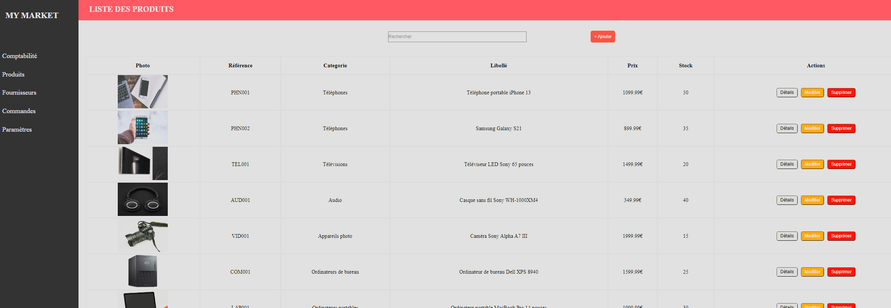

<h1 align="center">🗂️ Welcome to Backoffice 👋</h1>

  

---

## 📄 Description

🇫🇷 Ce projet est une **plateforme de gestion Backoffice** utilisant :

- 📁 Un fichier **JSON** pour importer les données
- 💾 L'API **LocalStorage** pour la persistance locale
- 💻 Réalisé en **HTML**, **CSS**, et **JavaScript**

🇬🇧 This project is a **Backoffice management platform** using:

- 📁 A **JSON file** to import data
- 💾 The **LocalStorage API** for local persistence
- 💻 Built with **HTML**, **CSS**, and **JavaScript**

---

## 🖼️ Aperçu | Preview

  

---

## 🚀 Démo en ligne | Live Demo

🔗 [Voir la démo / View Live Demo](https://schatel-dev.github.io/Backoffice/)

---

## 🧑‍💻 Technologies utilisées | Technologies Used

- HTML5  
- CSS3  
- JavaScript  
- JSON  
- LocalStorage

---

## 👤 Auteur | Author

**Sebastien C.**  
🎓 Promo 2025  
🔗 GitHub : [@schatel-dev](https://github.com/schatel-dev)

---

## 🌟 Support

🇫🇷 Si ce projet vous a été utile, pensez à lui attribuer une **étoile ⭐**.  
🇬🇧 If this project helped you, feel free to give it a **⭐**.

---
